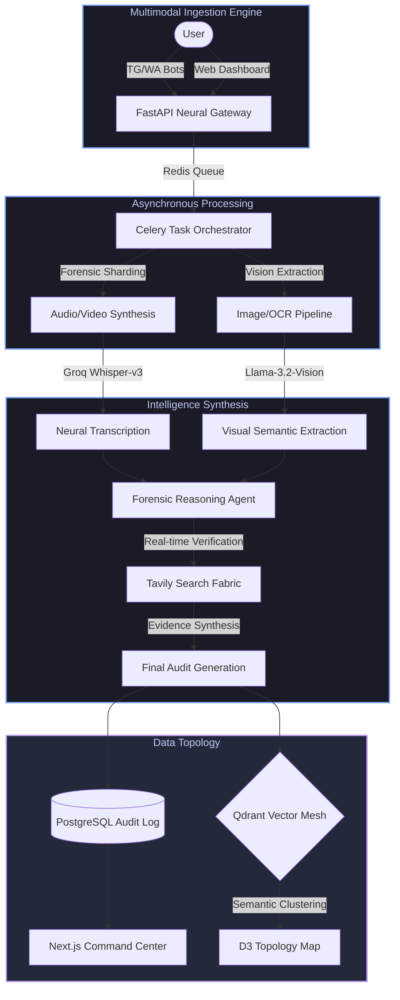

# 🛡️ Veridian: Forensic Intelligence & Multimodal Synthesis

> **The definitive neural infrastructure for neutralizing misinformation in the Post-Truth Era.**

[]()
[]()
[]()
[]()

Veridian is a high-fidelity **Forensic Intelligence Platform** engineered to safeguard digital integrity. By synthesizing raw multimodal data—ranging from low-bitrate audio captures to high-definition video streams—into cryptographically-styled **Trust Receipts**, Veridian provides an authoritative, immutable audit trail for the modern information landscape.

---

## 🏗️ Technical Architecture: The Neural Command Center

Veridian operates on a distributed, asynchronous orchestration layer designed for maximal throughput and latent semantic precision.



---

## 🛡️ Forensic Primitives

### 1. The Trust Receipt (The Forensic Artifact)
Veridian treats every claim as a forensic entity. Our **Trust Receipt System** generates high-density, stylized audit logs that bridge the gap between AI reasoning and human trust.
- **Topological Metadata**: Metadata headers including Origin Tracking and Intent Scoring.
- **Evidence Pulsing**: Real-time citation of authoritative sources with interactive provenance links.
- **Cross-Lingual Dialectics**: Simultaneous synthesis in English and High-Register Hindi for global geopolitical relevance.

### 2. Topological Narrative Clustering
Beyond individual fact-checks, Veridian maps the **Misinformation Continuum**. Utilizing D3.js and Qdrant-backed vector embeddings, our "Claim Map" clusters rumors into narrative **Constellations**. This allows analysts to identify coordinated influence operations by observing semantic density spikes in real-time.

### 3. Multimodal Analysis Pipelines
- **Audio Pulse**: Utilizing Groq Whisper-v3 for near-zero latency transcription of dialect-heavy audio.
- **Video Synthesis**: Frame-by-frame visual forensic hashing mapped against synthesized audio transcripts.
- **Image Provenance**: CLIP-based embedding comparison in **Qdrant** to detect out-of-context image recycling.

---

## 🚀 The Stack: Engineered for Prestige

| Layer | Professional Specification | Key Technologies |
| :--- | :--- | :--- |
| **Logic** | Asynchronous Micro-services | FastAPI, Celery, Redis |
| **Interface** | High-Fidelity Glassmorphism | Next.js 14, Tailwind, React Native |
| **Intelligence** | Low-Latency Neural Synthesis | Groq (Llama-3.1), LangGraph, Tavily |
| **Persistence** | Multi-Tier Semantic Mesh | PostgreSQL, Qdrant Vector DB, SQLite |
| **Forensics** | Specialized Computer Vision | OpenCV, CLIP, Pillow |

---

## 🏁 Operational Deployment

1. **Environmental Orchestration**:
   ```bash
   cp .env.example .env
   # Inject Groq, Tavily, and PostgreSQL Credentials
   ```

2. **Infrastructure Initialization**:
   ```bash
   docker compose up -d --build
   ```

3. **Neural Engine Spin-up**:
   ```bash
   python -m backend.main
   ```

4. **Command Center Access**:
   Access the high-fidelity dashboard at `http://localhost:3000`.

---

## 🏆 CodeWizards 2.0 SRMIST 2026 Submission

Veridian represents the pinnacle of AI-native misinformation response in the hackathon space.
- **Vector Intelligence**: Leveraged **Qdrant** for latent semantic search and narrative clustering.
- **Inference Speed**: Integrated **Groq** to achieve localized forensic reasoning in under 1.5 seconds.
- **Design Philosophy**: A "Military-Grade Forensic" aesthetic designed for mission-critical journalism.

---

> [!IMPORTANT]
> Veridian is not a Fact-Checker; it is a **Verification Protocol**. It is designed to be the definitive source of truth in an era defined by information warfare.

© 2026 Veridian Intelligence Labs. All Rights Reserved.
