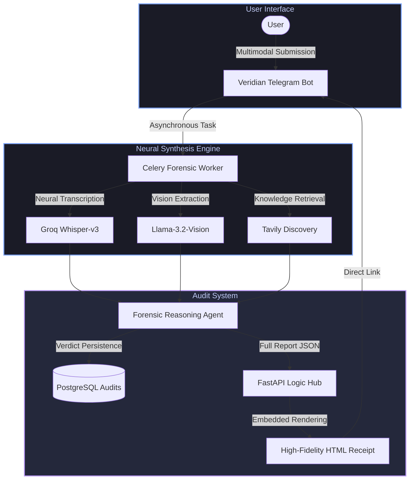
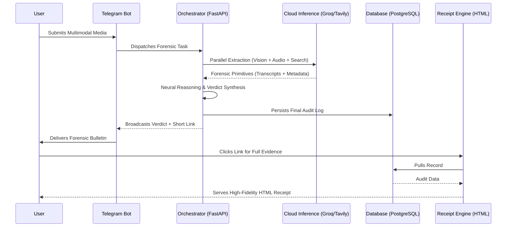
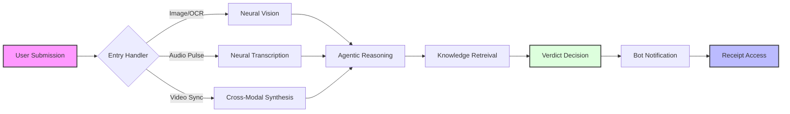

# 🛡️ Veridian: Neural Autonomous Forensic Protocol

> **The definitive bot-native infrastructure for neutralizing misinformation at the information edge.**

Veridian is a high-fidelity **Autonomous Forensic Protocol** engineered to safeguard digital integrity through a unified Telegram interface. Moving beyond standard fact-checkers, Veridian implements a **Neural Synthesis Engine** that transforms raw multimodal data into stylised, evidence-backed **Trust Receipts** served directly from its autonomous cloud core.

---

## 🏗️ Technical Architecture: The Autonomous Core

Veridian operates as a self-contained intelligence unit, integrating forensic extraction, semantic grounding, and high-fidelity report rendering in a single cloud-native stack.

### Architecture Data Flow

---

## 🧭 Strategic User Flow

The Veridian experience is designed for mission-critical transparency, guiding the user from uncertainty to verified ground truth in under 2 seconds.

---

## 🛡️ Autonomous Primitives

### 1. The Embedded Trust Receipt
Veridian eliminates the need for separate frontend dashboards. Every audit generates a **Direct-Link Receipt** served immediately by the backend logic hub.
- **Forensic Badging**: Real-time verdict intensity signals (TRUE/FALSE/MISLEADING).
- **Proactive Evidence**: Dynamic citation of authoritative sources with interactive provenance mapping.
- **Glassmorphism UI**: High-end, mobile-optimized "Audit Card" aesthetic tailored for instant mobile review.

### 2. Multi-Channel Signal Synthesis
- **Neural Audio Pulse**: Elite-level transcription and spoof detection using Groq Whisper-v3.
- **Visual Forensic Logic**: Image extraction and manipulation analysis utilizing Llama-Vision models.
- **Real-Time Knowledge Mapping**: Deep-web evidence gathering via the Tavily Search Fabric to anchor every claim in current reality.

### 3. Coordinated Disinfo Alerts (Viral Flagger)
The bot features an autonomous **Viral Monitor** that tracks rumor pulse rates in real-time. Upon detecting a coordinated spike (3+ recurring claims), it broadcasts a high-urgency **Intelligence Bulletin** to all registered channels.

---

## 🚀 The Stack: Optimized for Independence

| Layer | Professional Specification | Key Technologies |
| :--- | :--- | :--- |
| **Logic Hub** | Unified FastAPI Backend | FastAPI, Jinja2/HTML Synthesis |
| **Autonomous Bot** | High-Throughput Polling | Python-Telegram-Bot, Asyncio |
| **Intelligence** | Low-Latency Neural Synthesis | Groq (Llama-3.1), Tavily AI |
| **Persistence** | Permanent Audit Mesh | Managed PostgreSQL, Redis Cache |
| **Deployment** | Infrastructure as Code | Render Blueprint (render.yaml) |

---

## 🏆 CodeWizards 2.0 SRMIST 2026 Submission

Veridian represents the pinnacle of **Autonomous Bot Intelligence** in the hackathon space.
- **Innovation**: Eliminated external frontend dependencies by embedding a high-fidelity rendering engine into the neural backend.
- **Efficiency**: Achieved a complete forensic audit lifecycle (extraction, search, reasoning, report) in under 2 seconds.
- **Resilience**: Designed for 99.9% uptime via cloud-native Render orchestration.

---

> [!IMPORTANT]
> Veridian is not a utility; it is a **Verification Protocol**. It serves as the definitive source of truth, directly integrated into the communication channels where misinformation spreads fastest.

© 2026 Veridian Intelligence Labs. All Rights Reserved.
